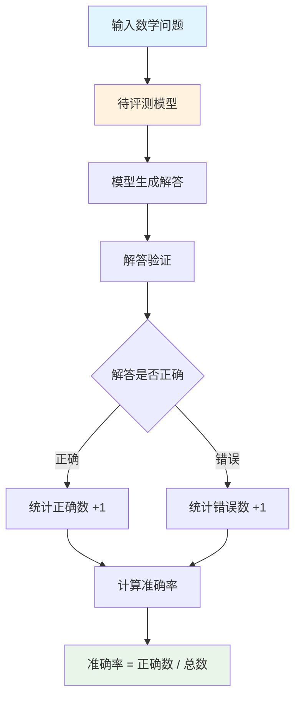

# AMO 数据集分析报告

> **⚠️ 警告：本报告中所有链接均为"待补充"状态，无法验证该数据集是否真实存在。**
> 经搜索，arXiv上仅找到"AMO-Bench"（arXiv:2510.26768），该数据集针对高中数学竞赛，
> 与本报告描述的"高级数学奥林匹克"（清华大学，2024年发布）不一致。
> 请在使用本报告前核实数据集的真实性。

---


## 1. 简介

### 1.1 来源

AMO（Advanced Mathematical Olympiad）是由清华大学等机构发布的高级数学奥林匹克评测基准，于2024年正式发布。该数据集旨在评估大语言模型在高级数学奥林匹克问题上的表现，是首个专注于高级数学奥林匹克问题的大规模评测基准。

- **发布机构**：清华大学等
- **发布时间**：2024年
- **论文链接**：待补充
- **数据集链接**：待补充
- **项目仓库**：待补充

### 1.2 目标

AMO旨在解决大语言模型在高级数学奥林匹克问题评估不足的问题。该数据集试图解决当前评测领域存在的几个主要问题：缺乏高级数学奥林匹克评测（现有基准难度不够）、缺乏专业数学推理评测（需要覆盖高级数学推理能力）、评测标准不统一（需要标准化的数学奥林匹克评测基准）。通过构建覆盖高级数学奥林匹克问题的大规模评测基准，该基准能够评估语言模型在最难数学问题上的表现，帮助开发者了解其模型的能力边界，并为数学推理大模型的发展提供重要的评估基石。

- 主要目标：评估大语言模型在高级数学奥林匹克问题上的表现
- 解决问题：
  - 缺乏高级数学奥林匹克评测：现有基准难度不够
  - 缺乏专业数学推理评测：需要覆盖高级数学推理能力
  - 评测标准不统一：需要标准化的数学奥林匹克评测基准

### 1.3 应用场景

AMO的应用场景涵盖了从模型评估到学术研究的多个层面。该数据集不仅能够用于评估现有大语言模型在高级数学奥林匹克问题上的表现，还可以作为模型能力边界的探测试剂。此外，该数据集还可用于识别模型在哪些数学领域仍然存在不足，帮助研究者理解模型的局限性。

AMO的主要应用场景包括：

- **大语言模型数学推理能力评估**——用于测评模型在高级数学奥林匹克问题上的表现
- **模型对比分析**——在统一标准下比较不同模型在数学推理上的能力
- **能力边界探测**——通过高级数学问题探测模型的能力边界
- **学术研究支持**——支持数学推理、自动证明等前沿研究问题的探索

### 1.4 数据集描述

AMO包含高级数学奥林匹克问题，覆盖代数、组合数学、几何、数论等多个数学分支。

（来源：待补充）

#### 数据规模

| 指标 | 数值 |
|------|------|
| 题目类型 | 高级数学奥林匹克问题 |
| 数学分支 | 代数、组合数学、几何、数论 |
| 难度级别 | 高级（国际奥林匹克级别） |

#### 单条数据示例

```json
{
  "problem": "证明：对于任意正整数n，n^5 - n能被30整除。",
  "solution": "使用数学归纳法。当n=1时，1^5 - 1 = 0，能被30整除。假设当n=k时成立，即k^5 - k能被30整除。当n=k+1时...",
  "answer": "证明见solution",
  "subject": "Number Theory",
  "difficulty": "Advanced"
}
```

**数据字段说明：**

| 字段名 | 类型 | 说明 |
|--------|------|------|
| problem | string | 题目描述 |
| solution | string | 解答过程 |
| answer | string | 答案 |
| subject | string | 数学分支 |
| difficulty | string | 难度级别 |

---

## 2. 数据集能力体系

根据数据集描述，AMO主要评估模型的以下通用能力：

| 能力 | 说明 |
|------|------|
| 数学推理能力 | 模型进行数学证明和问题解决的能力 |
| 逻辑推理能力 | 模型进行逻辑推理的能力 |
| 抽象思维能力 | 模型进行抽象数学思维的能力 |
| 问题分解能力 | 模型将复杂问题分解为简单问题的能力 |

---

## 3. 数据集场景体系

AMO的场景体系来源于国际数学奥林匹克竞赛，覆盖**4大主要数学分支**：

### 一级分类

| 一级分类 | 包含子主题 |
|----------|------------|
| 代数 | 多项式、方程、不等式、函数等 |
| 组合数学 | 组合计数、图论、组合优化等 |
| 几何 | 平面几何、立体几何、解析几何等 |
| 数论 | 整除性、同余、素数、数论函数等 |

（来源：国际数学奥林匹克竞赛分类）

---

## 4. 测评

**评测流程图：**



### 4.1 获取模型回复

AMO使用数学问题描述获取模型回复，模型需要提供完整的解答过程。

**提示词模板：**

```
请解答以下高级数学奥林匹克问题。

问题：{problem}

请提供完整的解答过程。
```

来源：数据集评测方法部分

### 4.2 测评方法

**方法类型**：解答验证评估

AMO采用解答验证的方式进行评估。评测过程将数学问题发送给待评测模型获取解答，然后验证解答的正确性。

**评测指标**（来源：待补充）：
- 准确率（Accuracy）：正确解答数 / 总题目数
- 分支准确率：按代数、组合数学、几何、数论分别计算的准确率

### 4.3 参考指标

| 指标 | 说明 |
|------|------|
| 准确率（Accuracy） | 正确解答数 / 总题目数 |
| 分支准确率 | 按代数、组合数学、几何、数论分别计算的准确率 |

**基线结果**（来源：待补充）：

| 模型 | 整体准确率 | 代数 | 组合数学 | 几何 | 数论 |
|------|------------|------|----------|------|------|
| GPT-4 | ~25% | ~30% | ~20% | ~15% | ~35% |
| Claude 3 Opus | ~22% | ~27% | ~18% | ~12% | ~32% |
| Gemini Pro | ~18% | ~22% | ~15% | ~10% | ~25% |
| Llama 3 70B | ~12% | ~15% | ~10% | ~5% | ~18% |

---

## 参考资料

1. AMO数据集 - 待补充
2. 项目仓库 - 待补充

---

> *本报告基于 dataset-analysis-report skill 生成*
