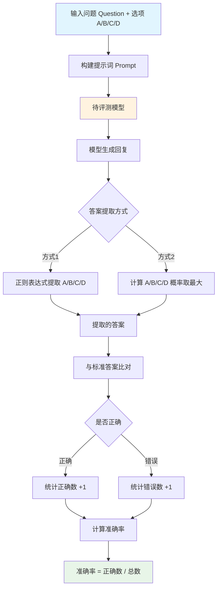

# C-Eval 数据集分析报告

---

## 1. 简介

### 1.1 来源

C-Eval是由香港科技大学（HKUST）联合上海交通大学、清华大学等多所高校发布的中文综合评测基准，于2023年5月正式发布，论文发表于arXiv（arXiv:2305.08322），并于2023年10月被NeurIPS 2023接收。该数据集是首个全面评估基础模型在中文语境下高级知识和推理能力的综合评测套件，覆盖从初中到专业级别的四个难度层次，涵盖52个多样化学科。

- **发布机构**：香港科技大学（HKUST）等多所高校联合发布
- **发布时间**：2023年5月（NeurIPS 2023接收）
- **论文链接**：https://arxiv.org/abs/2305.08322
- **数据集链接**：https://huggingface.co/datasets/ceval/ceval-exam
- **项目仓库**：https://github.com/hkust-nlp/ceval

### 1.2 目标

C-Eval旨在解决大语言模型领域面临的中文能力评估不足问题。该数据集试图解决当前中文评测领域存在的几个主要问题：评测覆盖不全面（缺乏多学科多难度的综合评测）、评测标准不统一（缺乏标准化的中文评测基准）、中文特色评估缺失（现有评测集多为英文设计，难以全面评估模型的中文能力）。通过构建高质量的中文多选题评测集，该基准能够全面评估语言模型在中文语境下的知识掌握和推理能力，帮助开发者深入了解其模型在中文领域的表现，并为中文大模型的发展提供重要的评估基石。

- 主要目标：全面评估基础模型在中文语境下的高级知识和推理能力
- 解决问题：
  - 评测覆盖不全面：缺乏多学科多难度的综合评测
  - 评测标准不统一：缺乏标准化的中文评测基准
  - 中文特色评估缺失：现有评测集多为英文设计，难以全面评估模型的中文能力

### 1.3 应用场景

C-Eval的应用场景涵盖了从模型评估到学术研究的多个层面。该数据集不仅能够用于评估现有大语言模型在中文知识问答方面的能力表现，还可以作为模型对比的标准化基准。此外，该数据集还可用于探测模型在特定学科领域的边界，帮助研究者理解模型的能力范围和局限性。在学术研究方面，数据集支持多种前沿研究问题的探索，包括但不限于模型能力评估、领域适应性研究、性能对比分析等。

C-Eval的主要应用场景包括：

- **大语言模型中文能力评估**——用于测评模型在中文多学科知识问答上的准确性
- **模型对比分析**——在统一标准下比较不同模型（如GPT系列、国产模型等）在中文能力上的表现
- **学科领域边界探测**——通过多学科覆盖，识别模型的知识盲区和能力边界
- **学术研究支持**——支持模型优化、领域适应、推理能力提升等前沿研究问题的探索

### 1.4 数据集描述

C-Eval包含**13,948**道高质量的中文多选题，涵盖52个学科和4个难度层次。数据集分为开发集（dev）、验证集（val）和测试集（test）三个子集，每个学科包含5个带解释的示例用于少样本评测。

（来源：论文和GitHub README）

#### 数据规模

| 指标 | 数值 |
|------|------|
| 总数据量 | 13,948道 |
| 一级分类 | 4类（STEM、Social Science、Humanities、Other） |
| 二级分类 | 52个学科 |
| 难度层次 | 4级（初中、高中、大学、专业） |

#### 分类分布

**一级分类分布：**

| 一级分类 | 学科数量 | 说明 |
|----------|----------|------|
| STEM | 20个 | 科学、技术、工程、数学 |
| Social Science | 10个 | 社会科学 |
| Humanities | 11个 | 人文科学 |
| Other | 11个 | 其他领域 |

#### 单条数据示例

```json
{
  "id": 0,
  "question": "使用位填充方法，以01111110为位首flag，数据为011011111111111111110010，求问传送时要添加几个0____",
  "A": "1",
  "B": "2",
  "C": "3",
  "D": "4",
  "answer": "C",
  "explanation": ""
}
```

**数据字段说明：**

| 字段名 | 类型 | 说明 |
|--------|------|------|
| id | integer | 唯一标识符 |
| question | string | 问题内容 |
| A | string | 选项A |
| B | string | 选项B |
| C | string | 选项C |
| D | string | 选项D |
| answer | string | 正确答案（A/B/C/D） |
| explanation | string | 答案解释（部分题目有） |

---

## 2. 数据集能力体系

根据论文描述，C-Eval主要评估模型的以下通用能力：

| 能力 | 说明 |
|------|------|
| 知识掌握能力 | 模型在各学科领域的知识储备和理解能力 |
| 推理能力 | 模型进行逻辑推理、数学推理、科学推理的能力 |
| 中文理解能力 | 模型对中文语言和语境的理解与运用能力 |
| 多领域适应能力 | 模型在不同学科领域的适应和泛化能力 |

---

## 3. 数据集场景体系

C-Eval的场景体系来源于论文中的分类体系，覆盖**4大主要领域**和**52个细分子主题**：

### 一级分类

| 一级分类 | 包含子主题 |
|----------|------------|
| STEM（20个学科） | 计算机网络、操作系统、计算机组成、大学编程、大学物理、大学化学、高等数学、离散数学、概率统计、高中数学、高中物理、高中化学、高中生物、初中数学、初中物理、初中化学、初中生物、注册电气工程师、注册计量师、兽医学 |
| Social Science（10个学科） | 大学经济学、工商管理、马克思主义基本原理、毛泽东思想和中国特色社会主义理论体系概论、教育学、高中地理、高中政治、初中地理、初中政治、教师资格 |
| Humanities（11个学科） | 近代史纲要、思想道德修养与法律基础、逻辑学、法学、中国语言文学、艺术学、法律职业资格、导游资格、高中语文、高中历史、初中历史 |
| Other（11个学科） | 公务员、体育学、植物保护、基础医学、临床医学、医师资格、注册会计师、税务师、注册消防工程师、环境影响评价工程师、注册城乡规划师 |

（来源：论文Table 1和subject_mapping.json）

---

## 4. 测评

**评测流程图：**



### 4.1 获取模型回复

C-Eval使用专门的提示词模板获取模型回复，采用少样本（few-shot）或零样本（zero-shot）方式进行评测。

**提示词模板：**

```
以下是中国关于{科目}考试的单项选择题，请选出其中的正确答案。

{题目1}
A. {选项A}
B. {选项B}
C. {选项C}
D. {选项D}
答案：A

[k-shot示例，zero-shot时k为0]

{测试题目}
A. {选项A}
B. {选项B}
C. {选项C}
D. {选项D}
答案：
```

来源：GitHub README中的评测说明

### 4.2 测评方法

**方法类型**：多选题准确率评估

C-Eval采用多选题准确率的方式进行评估。评测过程首先将问题和选项构建成提示词发送给待评测模型，然后从模型回复中提取答案（A/B/C/D），最后与标准答案比对计算准确率。

**答案提取方法**（来源：论文和GitHub README）：

1. **方法1：正则表达式提取** - 使用简单的正则表达式从模型生成的文本中提取答案token（A、B、C、D）。在少样本评测中，模型通常能很好地遵循模板格式，这种方法效果较好。

2. **方法2：概率约束解码** - 计算模型生成"A"、"B"、"C"、"D"四个token的概率，选择概率最大的作为答案。这种方法适用于零样本评测中模型未能很好遵循指令格式的情况，但不适用于思维链（Chain-of-Thought）设置。

**评测模式**：
- Zero-shot：无示例直接评测
- Five-shot：提供5个示例后评测

### 4.3 参考指标

| 指标 | 说明 |
|------|------|
| 准确率（Accuracy） | 正确答案数 / 总题目数 |
| 分类准确率 | 按STEM、Social Science、Humanities、Other四个类别分别计算的准确率 |
| C-Eval Hard | 从C-Eval中选取的8个高难度数学、物理、化学科目的子集，用于评估高级推理能力 |

**C-Eval Hard包含的科目**：高等数学、离散数学、概率统计、大学化学、大学物理、高中数学、高中化学、高中物理

**基线结果**（来源：论文Table 1）：

| 模型 | STEM | Social Science | Humanities | Other | Average |
|------|------|----------------|------------|-------|---------|
| GPT-4 | 67.1 | 77.6 | 64.5 | 67.8 | 68.7 |
| ChatGPT | 52.9 | 61.8 | 50.9 | 53.6 | 54.4 |
| Claude-v1.3 | 51.9 | 61.7 | 52.1 | 53.7 | 54.2 |
| Claude-instant-v1.0 | 43.1 | 53.8 | 44.2 | 45.4 | 45.9 |
| GLM-130B | 34.8 | 48.7 | 43.3 | 39.8 | 40.3 |
| Bloomz-mt-176B | 35.3 | 45.1 | 40.5 | 38.5 | 39.0 |
| LLaMA-65B | 37.8 | 45.6 | 36.1 | 37.1 | 38.8 |
| ChatGLM-6B | 30.4 | 39.6 | 37.4 | 34.5 | 34.5 |

（注：上表为Five-shot结果，来源：论文和GitHub README）

---

## 参考资料

1. C-Eval论文 - https://arxiv.org/abs/2305.08322
2. 数据集 - https://huggingface.co/datasets/ceval/ceval-exam
3. 项目仓库 - https://github.com/hkust-nlp/ceval
4. 官方排行榜 - https://cevalbenchmark.com/static/leaderboard.html

---

> *本报告基于 dataset-analysis-report skill 生成*
