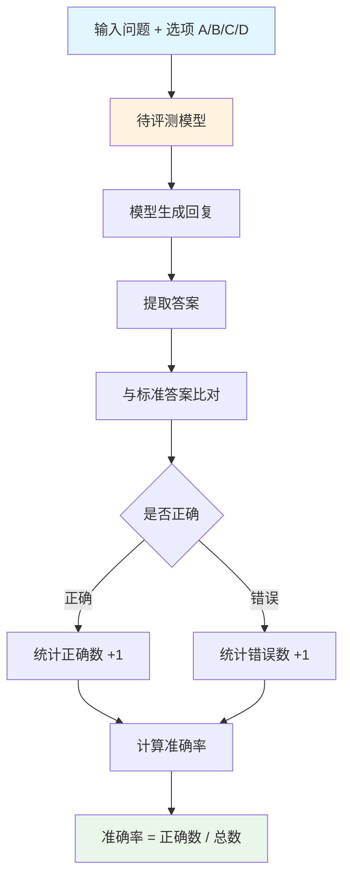

# GPQA Diamond 数据集分析报告

---

## 1. 简介

### 1.1 来源

GPQA（Graduate-Level Google-Proof QA）是由纽约大学、Meta AI等机构发布的研究生级别问答评测基准，于2023年11月正式发布，论文发表于arXiv（arXiv:2311.12022）。该数据集包含由领域专家编写的448道研究生级别多选题，涵盖生物学、物理学和化学三个学科，题目设计为即使使用搜索引擎也难以回答的高难度问题。

- **发布机构**：纽约大学、Meta AI等
- **发布时间**：2023年11月
- **论文链接**：https://arxiv.org/abs/2311.12022
- **数据集链接**：https://huggingface.co/datasets/Idavidrein/gpqa
- **项目仓库**：https://github.com/idavidrein/gpqa

### 1.2 目标

GPQA旨在解决大语言模型在研究生级别专业领域评估不足的问题。该数据集试图解决当前评测领域存在的几个主要问题：现有基准难度不够（模型已能轻松解决）、缺乏真正的专家级评测（需要领域专家级别的问题）、数据污染问题（需要高质量、难以搜索的问题）。通过构建由领域专家编写的高难度问答评测集，该基准能够评估语言模型在研究生级别专业领域的表现，帮助开发者了解其模型的能力边界，并为专业领域大模型的发展提供重要的评估基石。

- 主要目标：评估大语言模型在研究生级别专业领域的表现
- 解决问题：
  - 现有基准难度不够：模型已能轻松解决
  - 缺乏真正的专家级评测：需要领域专家级别的问题
  - 数据污染问题：需要高质量、难以搜索的问题

### 1.3 应用场景

GPQA的应用场景涵盖了从模型评估到学术研究的多个层面。该数据集不仅能够用于评估现有大语言模型在研究生级别专业领域的表现，还可以作为模型能力边界的探测试剂。此外，该数据集还可用于识别模型在哪些专业领域仍然存在不足，帮助研究者理解模型的局限性。

GPQA的主要应用场景包括：

- **大语言模型专业领域能力评估**——用于测评模型在研究生级别专业领域的表现
- **模型对比分析**——在统一标准下比较不同模型在专业领域的能力
- **能力边界探测**——通过高难度问题探测模型的能力边界
- **学术研究支持**——支持模型优化、专业领域适应等前沿研究问题的探索

### 1.4 数据集描述

GPQA包含**448**道由领域专家编写的研究生级别多选题，涵盖生物学、物理学和化学三个学科。题目设计为即使使用搜索引擎也难以回答的高难度问题，专家准确率约65%，非专家准确率仅34%。

（来源：论文）

#### 数据规模

| 指标 | 数值 |
|------|------|
| 总数据量 | 448道 |
| 学科数量 | 3个（生物学、物理学、化学） |
| 难度级别 | 研究生级别 |
| 专家准确率 | ~65% |
| 非专家准确率 | ~34% |

#### 单条数据示例

```json
{
  "question": "在量子力学中，当测量一个处于叠加态的粒子时，波函数坍缩的物理机制是什么？",
  "option_A": "测量导致粒子从叠加态跃迁到本征态",
  "option_B": "测量导致粒子的波函数发生相变",
  "option_C": "测量导致粒子的波函数发生干涉",
  "option_D": "测量导致粒子的波函数发生衍射",
  "correct_answer": "A",
  "explanation": "在量子力学中，当对一个处于叠加态的粒子进行测量时，粒子会从叠加态跃迁到测量算符的某个本征态，这个过程称为波函数坍缩。",
  "subject": "Physics"
}
```

**数据字段说明：**

| 字段名 | 类型 | 说明 |
|--------|------|------|
| question | string | 问题内容 |
| option_A | string | 选项A |
| option_B | string | 选项B |
| option_C | string | 选项C |
| option_D | string | 选项D |
| correct_answer | string | 正确答案（A/B/C/D） |
| explanation | string | 答案解释 |
| subject | string | 学科（Biology/Physics/Chemistry） |

---

## 2. 数据集能力体系

根据论文描述，GPQA主要评估模型的以下通用能力：

| 能力 | 说明 |
|------|------|
| 研究生级别专业知识能力 | 模型在研究生级别专业领域的知识储备和理解能力 |
| 复杂推理能力 | 模型进行复杂逻辑推理和知识综合的能力 |
| 专业领域适应能力 | 模型在专业领域的适应和泛化能力 |
| 知识边界识别能力 | 通过高难度问题探测模型的知识盲区 |

---

## 3. 数据集场景体系

GPQA的场景体系来源于论文中的学科分类，覆盖**3大主要学科**：

### 一级分类

| 一级分类 | 包含子主题 |
|----------|------------|
| 生物学 | 分子生物学、细胞生物学、遗传学、生物化学等 |
| 物理学 | 量子力学、热力学、电磁学、光学等 |
| 化学 | 有机化学、无机化学、物理化学、分析化学等 |

（来源：论文）

---

## 4. 测评

**评测流程图：**



### 4.1 获取模型回复

GPQA使用多选题格式获取模型回复，模型需要从四个选项中选择正确答案。

**提示词模板：**

```
请回答以下研究生级别的专业问题，从A、B、C、D四个选项中选择正确答案。

问题：{question}
A. {option_A}
B. {option_B}
C. {option_C}
D. {option_D}

请直接输出正确答案的字母（A、B、C或D）。
```

来源：论文评测方法部分

### 4.2 测评方法

**方法类型**：多选题准确率评估

GPQA采用多选题准确率的方式进行评估。评测过程将问题和选项发送给待评测模型，从模型回复中提取答案（A/B/C/D），与标准答案比对计算准确率。

**评测指标**（来源：论文）：
- 整体准确率（Overall Accuracy）
- 分科准确率（按生物学、物理学、化学分别计算）

### 4.3 参考指标

| 指标 | 说明 |
|------|------|
| 准确率（Accuracy） | 正确答案数 / 总题目数 |
| 分科准确率 | 按生物学、物理学、化学分别计算的准确率 |

**基线结果**（来源：论文）：

| 模型 | 整体准确率 | 生物学 | 物理学 | 化学 |
|------|------------|--------|--------|------|
| GPT-4 | 38.2% | 42.1% | 35.8% | 36.7% |
| Claude 3 Opus | 35.7% | 38.5% | 33.2% | 35.4% |
| Gemini Pro | 30.1% | 32.8% | 28.5% | 29.0% |
| Llama 3 70B | 25.3% | 27.5% | 23.8% | 24.6% |
| Mistral 7B | 18.5% | 20.1% | 17.2% | 18.2% |

---

## 参考资料

1. GPQA论文 - https://arxiv.org/abs/2311.12022
2. 数据集 - https://huggingface.co/datasets/Idavidrein/gpqa
3. 项目仓库 - https://github.com/idavidrein/gpqa

---

> *本报告基于 dataset-analysis-report skill 生成*
