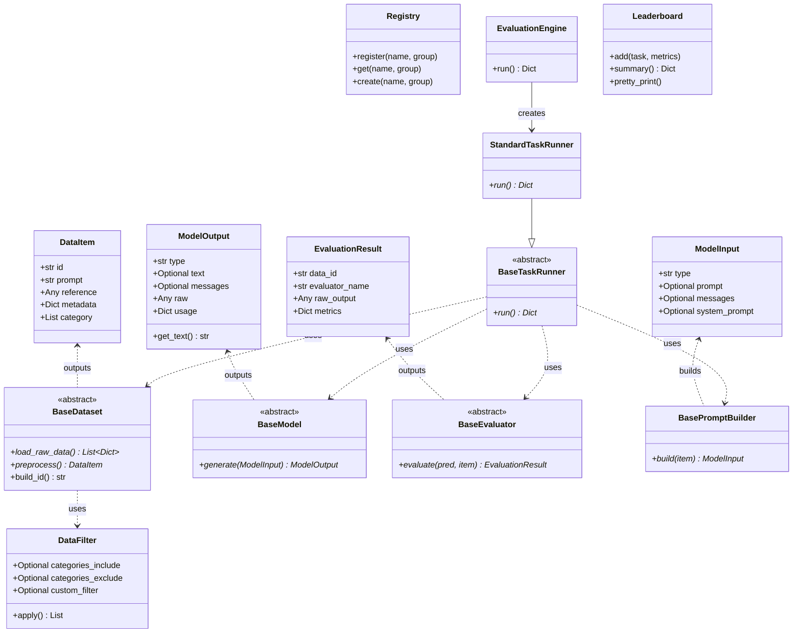

---
AIGC:
    ContentProducer: Minimax Agent AI
    ContentPropagator: Minimax Agent AI
    Label: AIGC
    ProduceID: "00000000000000000000000000000000"
    PropagateID: "00000000000000000000000000000000"
    ReservedCode1: 3046022100bc4d5c68997d28aea6c971309b719bebe3309327a04452d824490489688415e8022100dfc8420dd86775df2491c0c5dcdcaecb9283730cb9772387fb138218c6f7f87d
    ReservedCode2: 3046022100994705a3ed24c69b03cc89034b0a30729d61d7fe95ed63c90eaa2ea9b7697a54022100a53f1c8ecad3cef01a58c8a1bc36d493d952547bdf0987b1ccd88fbb21ee5ee9
---

# 评测框架 API 接口规范

## 1. 概述

本规范定义了评测框架的核心接口，包括数据类、基类、注册中心、引擎和工具类。所有实现必须遵循此规范以保证框架的通用性和可扩展性。

## 2. 数据类规范

### 2.1 DataItem

标准数据单元，所有数据集加载后必须转换为 `List[DataItem]` 格式。

```python
@dataclass
class DataItem:
    id: str                              # 必填，唯一标识符
    prompt: str                          # 必填，模型输入提示
    reference: Any                       # 必填，参考答案
    metadata: Dict[str, Any]             # 可选，元数据字典
    category: List[str]                   # 可选，分类标签列表
    difficulty: Optional[str]             # 可选，难度级别
    extra: Dict[str, Any]                # 可选，扩展字段
```

**字段说明：**

| 字段 | 类型 | 必填 | 说明 |
|------|------|------|------|
| id | str | 是 | 唯一标识符，格式：`{DatasetName}_{hash}` |
| prompt | str | 是 | 模型的输入提示 |
| reference | Any | 是 | 参考答案，类型根据任务而定 |
| metadata | Dict | 否 | 存储数据项相关元信息 |
| category | List[str] | 否 | **分类标签列表**，支持多标签分类（如学科、主题、类型等） |
| difficulty | str | 否 | 难度级别，如 easy/medium/hard |
| extra | Dict | 否 | 扩展字段，存储其他信息 |

**使用示例：**

```python
data_item = DataItem(
    id="ChineseSimpleQA_hash123",
    prompt="中国的首都是哪里？",
    reference="北京",
    metadata={
        "source": "wikipedia",
        "language": "zh"
    },
    category=["geography", "general"],
    difficulty="easy"
)
```

### 2.2 ModelInput

模型输入结构，用于构建调用模型时的参数。支持 text 和 chat 两种模式。

```python
@dataclass
class ModelInput:
    type: str                                    # 必填，"text" 或 "chat"
    prompt: Optional[str] = None                # text 模式：提示词
    messages: Optional[List[Dict[str, str]]] = None  # chat 模式：消息列表
    system_prompt: Optional[str] = None         # 可选，系统提示词
```

**字段说明：**

| 字段 | 类型 | 必填 | 说明 |
|------|------|------|------|
| type | str | 是 | 输入类型，"text" 或 "chat" |
| prompt | str | 否 | text 模式下的提示词 |
| messages | List[Dict] | 否 | chat 模式下的消息列表，格式：`[{"role": "user", "content": "..."}]` |
| system_prompt | str | 否 | 系统提示词 |

### 2.3 ModelOutput

模型输出结构，封装模型生成的结果。

```python
@dataclass
class ModelOutput:
    type: str                                    # 必填，"text" 或 "chat"
    text: Optional[str] = None                  # text 模式：生成文本
    messages: Optional[List[Dict[str, str]]] = None  # chat 模式：消息列表
    raw: Any = None                             # 原始响应
    usage: Dict[str, Any] = field(default_factory=dict)  # token 使用统计

    def get_text(self) -> str:
        """统一获取文本内容"""
        if self.type == "text":
            return self.text or ""
        elif self.type == "chat" and self.messages:
            return self.messages[-1].get("content", "")
        return ""

    def get_messages(self) -> List[Dict[str, str]]:
        """统一获取消息列表"""
        if self.type == "chat" and self.messages:
            return self.messages
        elif self.type == "text" and self.text:
            return [{"role": "assistant", "content": self.text}]
        return []
```

### 2.4 EvaluationResult

评估结果容器，封装评估器的输出。

```python
@dataclass
class EvaluationResult:
    data_id: str                      # 必填，对应数据项ID
    evaluator_name: str               # 必填，评估器名称
    raw_output: Any                   # 必填，模型原始输出
    metrics: Dict[str, Any]           # 必填，评估指标字典
    details: Dict[str, Any]          # 可选，详细结果
```

**字段说明：**

| 字段 | 类型 | 必填 | 说明 |
|------|------|------|------|
| data_id | str | 是 | 对应数据项ID |
| evaluator_name | str | 是 | 评估器名称 |
| raw_output | Any | 是 | 模型原始输出 |
| metrics | Dict | 是 | 评估指标字典，如 `{"accuracy": 0.95}` |
| details | Dict | 否 | 详细结果 |

## 3. 基类规范

### 3.1 BaseDataset

数据集基类，所有数据集加载器必须继承此类。

```python
class BaseDataset(ABC):
    def __init__(self, config):
        self.config = config
        self.limits = config.get("limits", None)
        self.dataset_name = self.__class__.__name__

    def load(self) -> List[DataItem]:
        raw_data = self.load_raw_data()
        if self.limits is not None:
            raw_data = raw_data[:self.limits]
        return [self.preprocess(item) for item in raw_data]

    @abstractmethod
    def load_raw_data(self) -> List[Dict[str, Any]]:
        """
        子类只负责加载原始数据
        """
        pass

    @abstractmethod
    def preprocess(self, data_item: Dict[str, Any]) -> DataItem:
        """
        将原始数据预处理为标准 DataItem
        """
        pass

    def build_id(self, raw_id: Any) -> str:
        """统一 ID 生成逻辑"""
        return f"{self.dataset_name}_{hash(str(raw_id))}"
```

**必需实现的方法：**

| 方法 | 返回值 | 说明 |
|------|--------|------|
| load_raw_data() | List[Dict] | 加载原始数据 |
| preprocess() | DataItem | 预处理单个数据项 |

**可选重写的方法：**

| 方法 | 返回值 | 说明 |
|------|--------|------|
| build_id() | str | 生成唯一标识符 |

### 3.2 BaseModel

模型基类，所有模型适配器必须继承此类。

```python
class BaseModel(ABC):
    def __init__(self, config):
        self.config = config

    @abstractmethod
    def generate(self, model_input: ModelInput) -> ModelOutput:
        """
        接收 ModelInput，返回 ModelOutput

        Args:
            model_input: 模型输入

        Returns:
            ModelOutput: 模型输出对象

        Raises:
            NotImplementedError: 子类必须实现此方法
        """
        pass
```

**注册示例：**

```python
@Registry.register("MyModel", "model")
class MyModel(BaseModel):
    def generate(self, model_input: ModelInput) -> ModelOutput:
        # 实现模型调用逻辑
        return ModelOutput(type="text", text="生成的文本")
```

### 3.3 BaseEvaluator

评估器基类，所有评估器必须继承此类。

```python
class BaseEvaluator(ABC):
    def __init__(self, config):
        self.config = config

    @abstractmethod
    def evaluate(self, pred: str, data_item: DataItem) -> EvaluationResult:
        """
        对比参考答案与模型输出，返回评估结果

        Args:
            pred: 模型预测文本
            data_item: 数据项（包含参考值和元数据）

        Returns:
            EvaluationResult: 评估结果对象
        """
        pass
```

**注册示例：**

```python
@Registry.register("accuracy", "evaluator")
class AccuracyEvaluator(BaseEvaluator):
    def evaluate(self, pred: str, item: DataItem) -> EvaluationResult:
        acc = 1.0 if pred.strip() == str(item.reference).strip() else 0.0
        return {"accuracy": acc}
```

## 4. 注册中心规范

### 4.1 Registry 基类

统一的注册中心，支持分组注册。

```python
class Registry:
    _registry: Dict[str, Dict[str, Type]] = {}

    @classmethod
    def register(cls, name: str, group: str):
        """注册装饰器，支持分组"""
        def wrapper(obj):
            cls._registry.setdefault(group, {})[name] = obj
            return obj
        return wrapper

    @classmethod
    def get(cls, name: str, group: str):
        """获取已注册的类"""
        return cls._registry[group][name]

    @classmethod
    def create(cls, name: str, group: str, **kwargs):
        """创建注册的类实例"""
        return cls.get(name, group)(kwargs)
```

**使用方式：**

```python
# 注册（支持分组）
@Registry.register("my_dataset", "dataset")
class MyDataset(BaseDataset):
    pass

@Registry.register("my_model", "model")
class MyModel(BaseModel):
    pass

@Registry.register("my_evaluator", "evaluator")
class MyEvaluator(BaseEvaluator):
    pass

# 获取
dataset_class = Registry.get("my_dataset", "dataset")
model_class = Registry.get("my_model", "model")

# 创建实例
dataset = Registry.create("my_dataset", "dataset", **config)
model = Registry.create("my_model", "model", **config)
```

**支持的分组：**

| group | 说明 |
|-------|------|
| dataset | 数据集 |
| model | 模型 |
| evaluator | 评估器 |
| prompt_builder | 提示词构建器 |

## 5. 提示词构建器

### 5.1 BasePromptBuilder

提示词构建器基类。

```python
class BasePromptBuilder:
    def __init__(self, config):
        self.config = config
```

**注册示例：**

```python
@Registry.register("qa_builder", "prompt_builder")
class QAPromptBuilder(BasePromptBuilder):
    def build(self, item: DataItem) -> ModelInput:
        return ModelInput(
            type="text",
            prompt=f"请回答以下问题：\n{item.prompt}"
        )
```

## 6. 配置类规范

### 6.1 DatasetConfig

数据集配置。

```python
@dataclass
class DatasetConfig:
    name: str                           # 数据集名称
    weight: float = 1.0               # 权重
    limit: Optional[int] = None        # 限制数量
    filter: Optional[DataFilter] = None  # 数据过滤器
```

### 6.2 BenchmarkConfig

基准配置。

```python
@dataclass
class BenchmarkConfig:
    name: str                           # 基准名称
    datasets: List[DatasetConfig]      # 数据集列表
    aggregation_method: str = "weighted_average"  # 聚合方法
```

### 6.3 RunConfig

运行配置。

```python
@dataclass
class RunConfig:
    tasks: List[Union[DatasetConfig, BenchmarkConfig]]  # 任务列表
    evaluator_configs: List[Dict[str, Any]]            # 评估器配置列表
    rounds: int = 1                                  # 运行轮次
    model_config: Dict[str, Any] = field(default_factory=dict)   # 模型配置
    extra_args: Dict[str, Any] = field(default_factory=dict)      # 额外参数
```

### 6.4 DataFilter

数据过滤器。

```python
@dataclass
class DataFilter:
    categories_include: Optional[List[str]] = None   # 包含的分类
    categories_exclude: Optional[List[str]] = None   # 排除的分类
    custom_filter: Optional[Callable[[Any], bool]] = None  # 自定义过滤函数

    def apply(self, data_items: List[Any]) -> List[Any]:
        """应用过滤器"""
        result = data_items
        if self.categories_include:
            result = [item for item in result
                     if any(cat in item.category for cat in self.categories_include)]
        if self.categories_exclude:
            result = [item for item in result
                     if not any(cat in item.category for cat in self.categories_exclude)]
        if self.custom_filter:
            result = [item for item in result if self.custom_filter(item)]
        return result
```

## 7. 任务运行器规范

### 7.1 BaseTaskRunner

任务运行器基类。

```python
class BaseTaskRunner(ABC):
    @abstractmethod
    def run(self) -> Dict[str, float]:
        """
        执行任务

        Returns:
            Dict[str, float]: metric_name -> value
        """
        pass
```

### 7.2 StandardTaskRunner

标准单任务运行器。

**核心功能：**
- 组件初始化（数据集、模型、评估器、提示词构建器）
- 并发执行支持（ThreadPoolExecutor）
- 断点续跑支持
- 结果实时写入

**配置项：**

| 配置项 | 说明 |
|--------|------|
| dataset.name | 数据集名称 |
| dataset.params | 数据集参数 |
| model.name | 模型名称 |
| model.params | 模型参数 |
| evaluators | 评估器列表 |
| prompt_builder.name | 提示词构建器名称 |
| prompt_builder.params | 提示词构建器参数 |
| num_workers | 并发线程数 |
| output_path | 输出目录 |
| run_name | 运行名称 |

## 8. 引擎与工具类

### 8.1 EvaluationEngine

评测执行引擎，负责协调整个评测流程。

```python
class EvaluationEngine:
    def __init__(self, config):
        self.config = config
        # 自动导入所有模块
        auto_import("datasets")
        auto_import("models")
        auto_import("evaluators")
        auto_import("tasks")
        auto_import("prompt_builder")

    def run(self):
        """
        执行完整的评测流程

        支持单任务和多任务模式
        """
        pass
```

### 8.2 Leaderboard

排行榜收集器。

```python
class Leaderboard:
    def __init__(self):
        self.results = {}

    def add(self, task_name: str, metrics: dict):
        """添加任务结果"""
        self.results[task_name] = metrics

    def summary(self) -> dict:
        """获取汇总结果"""
        return self.results

    def pretty_print(self):
        """格式化打印结果"""
        pass
```

### 8.3 BaseTool

工具基类。

```python
class BaseTool(ABC):
    def __init__(self, config):
        self.config = config

    def setup(self):
        """工具初始化"""
        raise NotImplementedError

    def run(self, model):
        """执行工具"""
        raise NotImplementedError

    def get_results(self):
        """获取结果"""
        raise NotImplementedError
```

### 8.4 BaseReport

报告基类。

```python
class BaseReport:
    def __init__(self, config):
        self.config = config
        self.results = []

    def add_result(self, result):
        """添加结果"""
        self.results.append(result)

    def generate(self):
        """生成报告"""
        raise NotImplementedError

    def save(self, path):
        """保存报告"""
        raise NotImplementedError
```

## 9. 接口关系图



## 10. 扩展点说明

### 10.1 数据集扩展

```
自定义数据集
    ↓
继承 BaseDataset
    ↓
实现 load_raw_data() 和 preprocess()
    ↓
使用 @Registry.register("name", "dataset") 注册
    ↓
在配置中通过 name 引用
```

### 10.2 评估器扩展

```
自定义评估器
    ↓
继承 BaseEvaluator
    ↓
实现 evaluate() 方法
    ↓
使用 @Registry.register("name", "evaluator") 注册
    ↓
在配置中添加评估器配置
```

### 10.3 模型扩展

```
自定义模型适配器
    ↓
继承 BaseModel
    ↓
实现 generate() 方法
    ↓
使用 @Registry.register("name", "model") 注册
    ↓
在配置中指定模型名称
```

### 10.4 提示词构建器扩展

```
自定义提示词构建器
    ↓
继承 BasePromptBuilder
    ↓
实现 build() 方法
    ↓
使用 @Registry.register("name", "prompt_builder") 注册
    ↓
在配置中指定提示词构建器
```

## 11. 兼容性要求

所有接口必须满足以下兼容性要求：

1. **向后兼容**：新增字段必须设置默认值
2. **类型提示**：所有公共接口必须有类型提示
3. **文档注释**：所有公共方法必须有 docstring
4. **异常处理**：合理抛出有意义的异常信息
5. **分组注册**：使用 Registry 时必须指定 group 参数
